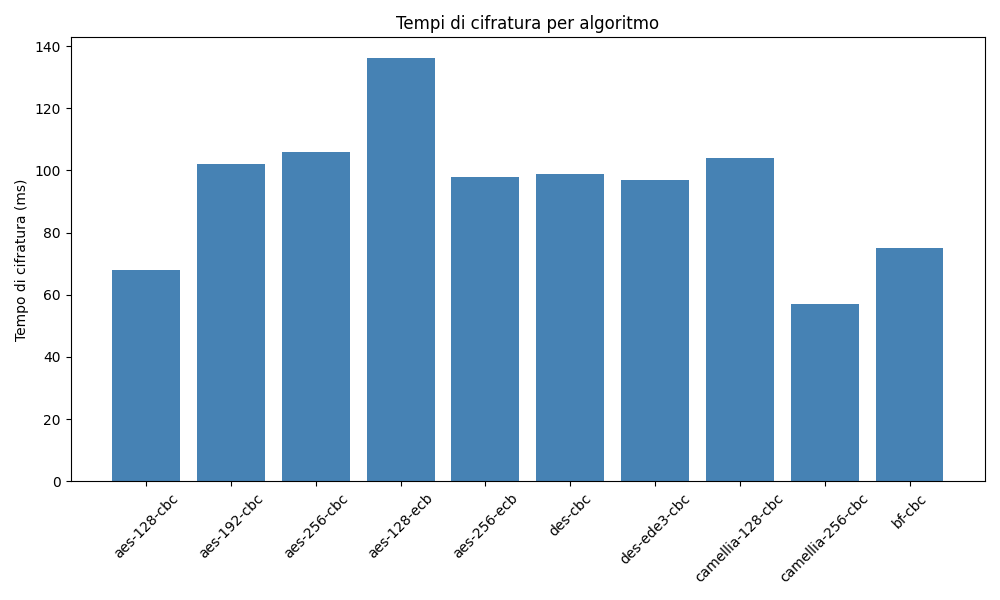
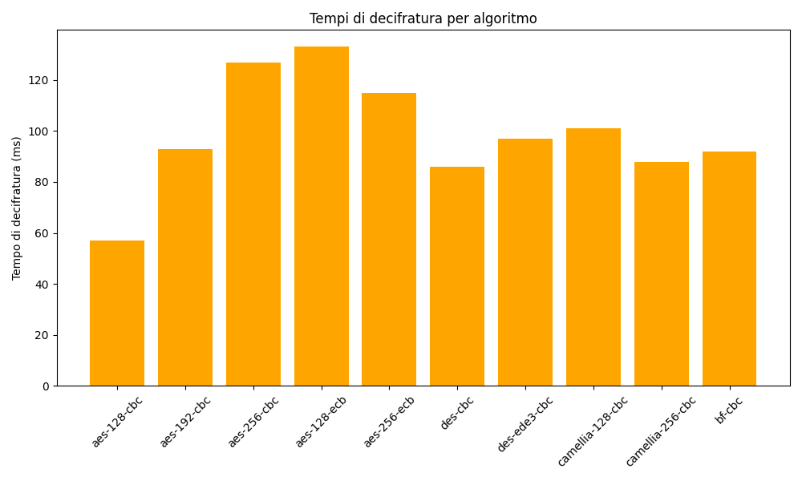

# System_Security
# Perché serve OpenSSL 1.1 legacy nel progetto?

Le versioni moderne di OpenSSL (3.x e successive) hanno disabilitato o rimosso il supporto per molti algoritmi di cifratura considerati insicuri o legacy, come DES, Blowfish, RC4 e altri. Questi algoritmi sono ancora utili per scopi didattici, per la compatibilità con software legacy o per analisi di sicurezza.

Installare la versione legacy di OpenSSL (1.1.x) all'interno del progetto permette di:
- Eseguire cifratura e decifratura con tutti gli algoritmi richiesti dagli esercizi, anche quelli non più supportati da OpenSSL 3.x.
- Garantire che lo script funzioni su qualsiasi sistema operativo, senza dipendenze esterne o modifiche alla configurazione globale.
- Evitare errori come "unsupported cipher" o "Error setting cipher" che si verificano con OpenSSL 3.x.

In questo modo, il progetto rimane portabile, riproducibile e adatto a scopi didattici e di laboratorio.

## Compilazione OpenSSL 1.1 legacy su Linux/WSL

1. Vai nella cartella:
   ```bash
   cd Homework_1/openssl_simmetrico/legacy_openssl
   ```
2. Scarica i sorgenti (usa wget con redirect o curl -L):
    ```bash
    wget --max-redirect=5 https://www.openssl.org/source/openssl-1.1.1w.tar.gz
    # oppure
    curl -L -O https://www.openssl.org/source/openssl-1.1.1w.tar.gz
    tar -xzf openssl-1.1.1w.tar.gz
    cd openssl-1.1.1w
    ```
3. Compila e installa localmente:
   ```bash
   ./config --prefix=$(pwd)/../install --openssldir=$(pwd)/../install/ssl
   make
   make install
   ```

## Compilazione OpenSSL 1.1 legacy su macOS

1. Installa Xcode Command Line Tools (se non già installati):
   ```bash
   xcode-select --install
   ```
2. Vai nella cartella:
   ```bash
   cd Homework_1/openssl_simmetrico/legacy_openssl
   ```
3. Scarica i sorgenti (usa curl -L per seguire i redirect):
    ```bash
    curl -L -O https://www.openssl.org/source/openssl-1.1.1w.tar.gz
    tar -xzf openssl-1.1.1w.tar.gz
    cd openssl-1.1.1w
    ```
4. Compila e installa localmente:
   ```bash
   ./Configure darwin64-x86_64-cc --prefix=$(pwd)/../install --openssldir=$(pwd)/../install/ssl
   make
   make install
   ```

## Note per utenti Windows

Su Windows, per eseguire questo progetto è necessario installare WSL (Windows Subsystem for Linux) oppure un ambiente simile che supporti Bash (ad esempio Git Bash o Cygwin). Dopo aver installato WSL, segui la procedura indicata per i sistemi Linux per compilare OpenSSL 1.1 legacy all'interno del repository.

OpenSSL 1.1 non è disponibile tramite i normali gestori di pacchetti Windows o Linux moderni, quindi la compilazione locale è obbligatoria per garantire compatibilità e portabilità.

Dopo la compilazione, lo script userà automaticamente la versione locale di OpenSSL legacy.

## Risultati: Tempi di cifratura



## Risultati: Tempi di decifratura



## Considerazioni sulla scelta dell'algoritmo

La scelta dell'algoritmo di cifratura non deve basarsi esclusivamente sull'aspetto della sicurezza, ma anche sui tempi di esecuzione delle operazioni di cifratura e decifratura. Come mostrano i grafici sopra, algoritmi diversi possono avere prestazioni molto differenti. In applicazioni dove la rapidità è fondamentale (ad esempio sistemi embedded, streaming, applicazioni real-time), è importante bilanciare la robustezza crittografica con l'efficienza operativa. La valutazione va quindi fatta considerando il contesto d'uso, il livello di sicurezza richiesto e le risorse disponibili.
